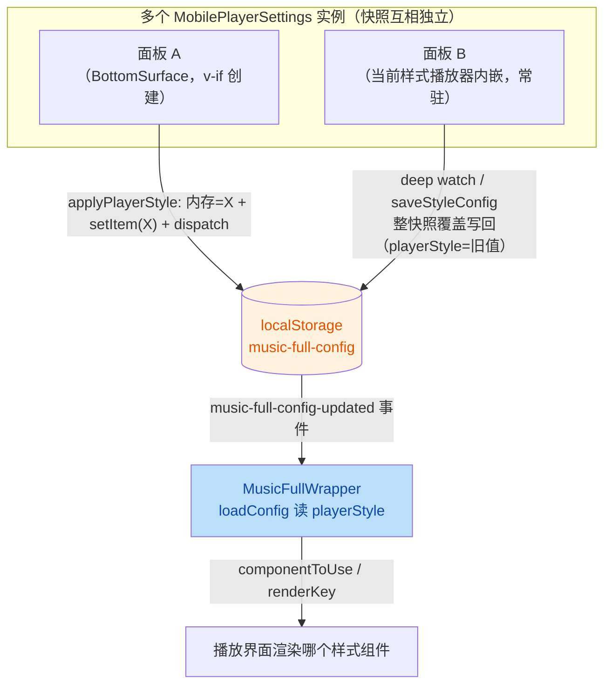

# 修复：播放器样式切换不生效且被回写为旧样式

## 摘要

在播放界面设置面板中点击样式按钮后：按钮立即显示选中（内存快照已更新），但播放界面不变；重新打开面板后选中态又变回旧样式（如"错误"）。根因是 **MobilePlayerSettings 持有实例私有的 lyricConfig 内存快照、不监听外部配置更新事件，且所有写路径都是"整快照覆盖式"写回 localStorage**。多个面板实例并存时（8 个样式播放器各内嵌一个面板 + MobilePlayerBottomSurface 的面板），任何一个持有旧快照的实例触发写回，都会把过时的 `playerStyle` 写回 localStorage 并派发 `music-full-config-updated` 事件，把 MusicFullWrapper 已切换（或即将切换）的样式"拉回"旧值。

## 现状分析

### 样式切换数据流（现状）



### 关键代码事实

1. **私有快照，无同步**：[MobilePlayerSettings.vue](file:///C:/Users/Administrator/Desktop/zephyrus-player-android/src/renderer/components/player/MobilePlayerSettings.vue) L1907 `const lyricConfig = ref(loadStoredLyricConfig())` —— 组件实例创建时读一次 localStorage，之后**不监听** `music-full-config-updated` 事件，外部修改它永远感知不到。

2. **覆盖式写回**：L1940-1947 deep watch、L2080-2093 saveStyleConfig、L2017-2021 applyPlayerStyle、L2070 resetCurrentStyleConfig 等，全部 `localStorage.setItem('music-full-config', JSON.stringify(整个快照))` —— 过时快照中的 `playerStyle` 会覆盖其他实例刚写入的新值。

3. **多实例并存**：每个样式播放器组件内嵌一个面板（ErrorMobilePlayer.vue L187、StageMobilePlayer.vue L285 附近、StarChartPlayer/SmokeMobilePlayer/RainMobilePlayer/NeonMobilePlayer/EerieMobilePlayer/FrenzyMobilePlayer 各一处），加 MobilePlayerBottomSurface.vue L70-75 的 `v-if="surfaceMode === 'settings'"` 面板。全屏播放器切换样式时新旧播放器共存期间、或 BottomSurface 面板挂载期间，至少两个实例各持一份快照。

4. **播放界面数据源独立**：[MusicFullWrapper.vue](file:///C:/Users/Administrator/Desktop/zephyrus-player-android/src/renderer/components/lyric/MusicFullWrapper.vue) L46-65 每次事件时从 localStorage 读 `playerStyle`；L126-149 决定渲染组件与 renderKey。

5. **saveStyleConfig 触发链**：L2095-2096 `watch(styleConfig, saveStyleConfig, deep)` + `watch(currentPlayerStyle, loadStyleConfig)` —— 样式切换（currentPlayerStyle 变化）→ loadStyleConfig 改 styleConfig → **自动触发 saveStyleConfig 整快照写回 + 派发事件**。这是"点击新样式后旧值被写回"的主要内部放大器。

### 现象解释

- 按钮显示选中：面板自己的内存快照 `lyricConfig.value.playerStyle` 已更新（选中态来源，L2008-2010）。
- 界面不变：另一个存活实例（旧快照 playerStyle='error'）的 deep watch / saveStyleConfig 在点击后触发，把 error 写回 localStorage 并 dispatch → MusicFullWrapper loadConfig 读到 error → 组件保持/切回 error。
- 重开面板变回旧样式：新面板实例（或 BottomSurface 的 v-if 面板重建）从 localStorage 读到被覆盖的 error。

## 修复方案

统一"样式状态"的读写一致性：**所有面板实例快照实时同步 + 写回改为防御性合并**。改动集中在 MobilePlayerSettings.vue 一个文件（所有 8+1 个面板实例共用该组件，一次修复全部生效）。

### 修改文件：src/renderer/components/player/MobilePlayerSettings.vue

#### 改动 1：监听配置更新事件，实时刷新快照（核心修复）

在 lyricConfig 定义后新增：

```ts
// 抑制自身写入引发的事件回灌，避免"刷新快照→deep watch 写回→再触发事件"的循环
let suppressConfigSync = false;

const handleExternalConfigUpdate = () => {
  if (suppressConfigSync) return;
  const latest = loadStoredLyricConfig();
  // 仅当外部值与本实例快照不同才刷新，避免无谓的 deep watch 触发
  if (JSON.stringify(latest) !== JSON.stringify(lyricConfig.value)) {
    suppressConfigSync = true;
    lyricConfig.value = latest;
    void nextTick(() => {
      suppressConfigSync = false;
    });
  }
};

window.addEventListener('music-full-config-updated', handleExternalConfigUpdate);
onUnmounted(() => {
  window.removeEventListener('music-full-config-updated', handleExternalConfigUpdate);
});
```

同时修改 L1940 的 deep watch，加入抑制判断：

```ts
watch(
  lyricConfig,
  (value) => {
    if (suppressConfigSync) return; // 快照刷新期间不写回
    persistLyricConfig(value); // 见改动 2
  },
  { deep: true }
);
```

#### 改动 2：所有整快照写回改为"读-合并-写"

新增统一持久化函数（替换现有 8 处 `localStorage.setItem('music-full-config', JSON.stringify(...))` 直接调用，L1943/2019/2070/2088/2136/2142/2155/2172/2178）：

```ts
/**
 * 防御性写回：以最新 localStorage 为底合并本实例变更，
 * 避免过时快照整体覆盖（尤其防止把旧 playerStyle 写回去覆盖其他面板的新选择）
 */
function persistLyricConfig(next: LyricConfig) {
  try {
    let latest: Record<string, unknown> = {};
    try {
      latest = JSON.parse(localStorage.getItem('music-full-config') || '{}');
    } catch {
      latest = {};
    }
    localStorage.setItem('music-full-config', JSON.stringify({ ...latest, ...next }));
  } catch {
    // 存储不可用时保持内存态即可
  }
  suppressConfigSync = true;
  window.dispatchEvent(new CustomEvent('music-full-config-updated'));
  void nextTick(() => {
    suppressConfigSync = false;
  });
}
```

注意：`{ ...latest, ...next }` 中 next 的 playerStyle 覆盖 latest —— 这是正确的（applyPlayerStyle 场景就是要把新样式持久化）；而 next 中**未被本实例修改但可能过时的字段**风险由改动 1 的实时同步消除（快照不再过时）。两层防御共同保证任何时序下 localStorage 不被旧值覆盖。

#### 改动 3：saveStyleConfig 同样走 persistLyricConfig

L2080-2093 saveStyleConfig 中 `lyricConfig.value.styleCustomConfig[...] = ...` 后调用 `persistLyricConfig(lyricConfig.value)`，替换原有 setItem+dispatch 两行。

#### 改动 4：applyPlayerStyle / resetCurrentStyleConfig / toggle 系列函数

L2017-2021 applyPlayerStyle、L2063-2078 resetCurrentStyleConfig、L2134-2178（toggleShowTranslation 等显式 setItem 的函数）统一改为调用 `persistLyricConfig(lyricConfig.value)`，删除各自的 setItem + dispatch 重复代码。

## 不改动的部分

- MusicFullWrapper.vue：现有"监听事件→loadConfig→切换组件"链路正确，不动。
- 8 个样式播放器组件与 BottomSurface：它们只是 MobilePlayerSettings 的宿主，修复在组件内部完成即全部生效。
- PhotosensitivityWarning / error 样式光敏警告逻辑：与本 bug 无关（writePlayerStyleConfig 仅在用户显式拒绝时写 default）。

## 验证步骤

1. `npm run typecheck:node`（web 侧存在约 100 个历史类型错误，确认本次改动文件无新增报错即可）。
2. 手动场景验证（dev 或 Android 设备）：
   - 切到"错误"样式 → 打开设置面板 → 点击"星盘"：播放界面应立即切换，面板选中态保持"星盘"；
   - 切换后关闭再重新打开设置面板：选中态应仍为"星盘"（不被写回"错误"）；
   - 在 BottomSurface 面板（非全屏）切换样式 → 再上滑进入全屏：应显示新样式；
   - 样式自定义配置（滑块等）在切换样式后仍正常保存/恢复（styleCustomConfig 不丢）。
3. 控制台无 `music-full-config-updated` 事件风暴（suppress 机制生效，无无限循环）。
