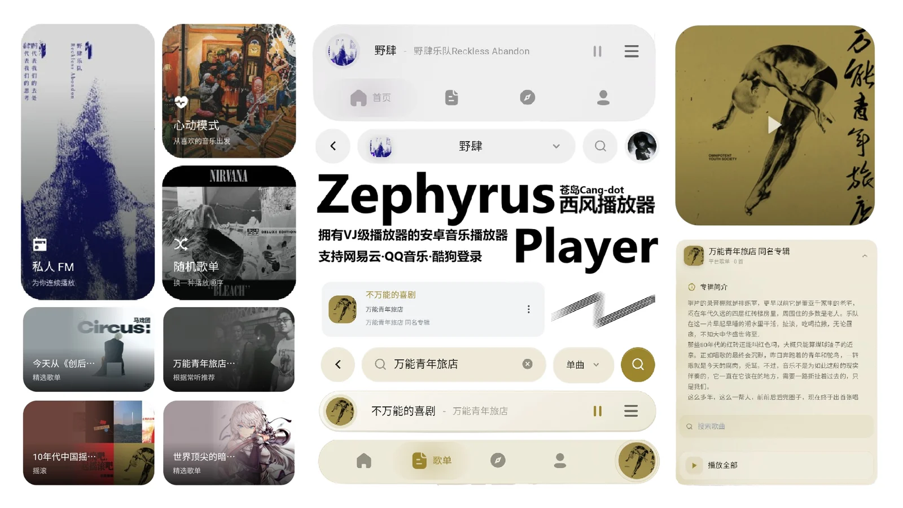

# Zephyrus Player

<p align="center">
  
</p>

Zephyrus Player 是一款只为 Android 手机设计的音乐播放器：歌曲、歌词和播放器舞台共享同一条时间轴，常用操作围绕单手触控和可中断动画组织。它同时提供**网页版**——电脑浏览器打开即可使用同一套账号与播放能力。

[](https://github.com/cang-dot/zephyrus-player-android/releases/tag/v1.3.5)
[](https://developer.android.com/about/versions/oreo)
[](https://mucang.xyz/zephyrus/web/)
[](https://vuejs.org/)
[](./LICENSE)

## 下载

- [GitHub Release v1.3.5](https://github.com/cang-dot/zephyrus-player-android/releases/tag/v1.3.5)
- [服务器直链](https://mucang.xyz/zephyrus/apks/zephyrus-player-latest.apk)
- [Android 产品介绍](https://mucang.xyz/zephyrus/)
- [使用文档](https://mucang.xyz/zephyrus/docs/)

安装需要 Android 8.0 或更高版本。首次启动按提示授予通知、悬浮窗和本地文件访问权限；没有这些权限时，基础播放仍可使用，但对应功能会保持关闭。

## 网页版

电脑浏览器打开 [mucang.xyz/zephyrus/web](https://www.mucang.xyz/zephyrus/web/) 即可直接使用，无需安装：

<p align="center">
  
</p>

- 与 Android 端同一套网易云 / QQ 音乐 / 酷狗账号体系，歌单、收藏与播放状态互通；
- 完整的搜索、歌单/专辑详情、播放队列与歌词展示；播放器支持封面大小、对齐、背景预设（极光 / 流体 / MD3 动态）等自定义；
- 本地文件扫描、悬浮窗与状态栏歌词等依赖手机硬件的能力在网页版保持关闭；
- 网页版与安卓端共用同一套部署与更新通道，功能随版本持续同步。

## 主要能力

### 歌词时间轴

歌词按以下顺序尝试加载：

1. Zephyrus TTML
2. AMLL TTML
3. 网易云 YRC
4. QQ 音乐 QRC
5. 普通 LRC

TTML 可以同时携带主唱、背景、对唱、翻译和罗马音。默认播放器与独立滚动歌词使用 AMLL Vue 组件渲染，缺少逐字时间时会自然回退到行级歌词。点击歌词可定位，长按可进入歌词选择；手势、系统返回和播放界面切换不会改变音频播放状态。

### 移动播放器

当前版本提供默认、舞台、诡谲、狂热、陈旧、雨夜、星盘、烟雾和错误九种样式。样式会独立保存背景、字体、歌词颜色、对齐方式和高潮效果；默认样式也支持大封面、滚动歌词和沉浸式底栏。

「错误」样式基于 WebGL 流体：纯黑背景上以歌曲主题色高速流动，叠加 CRT 扫描线与老电视颗粒噪点；大字宋体歌词以溶解方式进出并带 RGB 色散，高潮段落触发全屏错误爆发。该样式包含高频闪光，首次启用会提供光敏性癫痫警告。

### 主界面导航

四个主界面以常驻 pager 承载：横滑时当前页与相邻页跟手平移，松手按速度弹簧滑入目标页；每个界面独立记忆滚动位置。

### 音频与过渡

- 播放中跳转进度会保持播放，暂停中跳转仍保持暂停。
- 快速切歌只处理最新请求，旧音频的延迟事件不会重新暂停或启动当前歌曲。
- 智能过渡支持轻量到智能的连续调节、无缝切歌和可中断的加载反馈。
- 播放器的打开与关闭接入全局弹簧进度：拖拽跟手、松手按速度滑入或滑出，可随时反向。
- 本地文件播放失败时只提示一次并安全推进队列，不会在同一首歌上重复循环报错。
- **在线歌曲同样驱动音频响应**：鼓点、能量与 BPM 特征由原生引擎分析提供，本地与在线歌曲一视同仁。

### 来源与账号

支持网易云、QQ 音乐、酷狗和本地音乐的搜索、歌单与收藏。QQ 音乐扫码登录由服务端中转，Spotify 登录受 Spotify 开发者应用白名单限制，未配置应用时会明确显示不可用状态，不会伪造登录成功。

网易云分享链接可以在系统分享面板中选择 Zephyrus 直接打开对应歌曲；歌词海报二维码的中继页也支持一键唤起网易云音乐。

### 歌词 AI 解析

歌词设置中可以选择云端模型并查看每日积分。网关只接收歌曲元数据和歌词文本，不接收账号密码；模型列表、倍率、流式输出、Markdown 展示和纯文本复制都在同一面板完成。部署说明见 [`docs/ai-gateway-deployment.md`](./docs/ai-gateway-deployment.md)。

## 开发

```bash
npm install
npm run dev:web
```

常用检查：

```bash
npm run test:lyrics
npm run test:ai-gateway
npm run typecheck
npm run build
npx cap sync android
cd android
./gradlew.bat assembleRelease --no-daemon
```

APK 输出在 `android/app/build/outputs/apk/release/app-release.apk`。连接已授权设备后可以覆盖安装：

```bash
adb install -r android/app/build/outputs/apk/release/app-release.apk
```

## 项目结构

```text
src/renderer/
├── layout/            移动布局、Tab pager、顶栏与底栏 Dock
├── components/        播放器样式、歌词、设置、通用组件
├── playerStyles/      九种播放器样式的注册与配置
├── composables/       手势、过渡、外观与持久化逻辑
├── services/          音频、歌词、平台账号与原生桥接
├── store/modules/     播放、歌词、样式、账号和过渡状态
├── utils/             歌词解析、调度器、手势与生命周期工具
└── views/             首页、歌单、发现、我的与二级页面
android/               Capacitor Android 容器与原生桥接
relay/                 歌词海报二维码中继页
website/               VitePress 文档站
product-site/          Android 产品介绍站
server-ai-gateway.js   云端歌词 AI 网关
```

## 致谢与许可证

滚动歌词使用 [Apple Music-like Lyrics](https://github.com/amll-dev/applemusic-like-lyrics) 的 Vue 组件；「错误」样式的流体背景改编自 [vue-bits](https://github.com/DavidHDev/vue-bits) 的 LiquidEther 组件，遵循其开源许可证并在应用关于页面与文档站致谢。项目整体使用 [AGPL-3.0-only](./LICENSE) 发布；第三方依赖的许可证以各自仓库为准。

问题反馈请提交 [GitHub Issues](https://github.com/cang-dot/zephyrus-player-android/issues)，并附上 Android 版本、歌曲来源、歌词格式、播放器样式和复现步骤。
