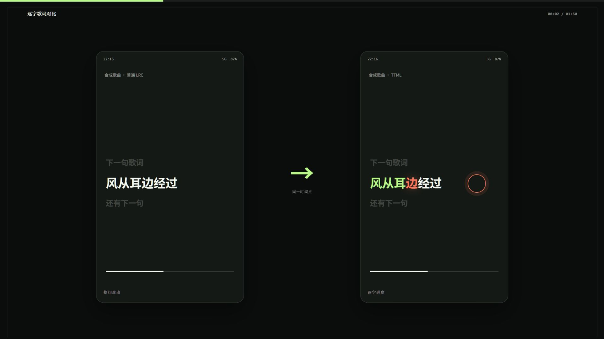
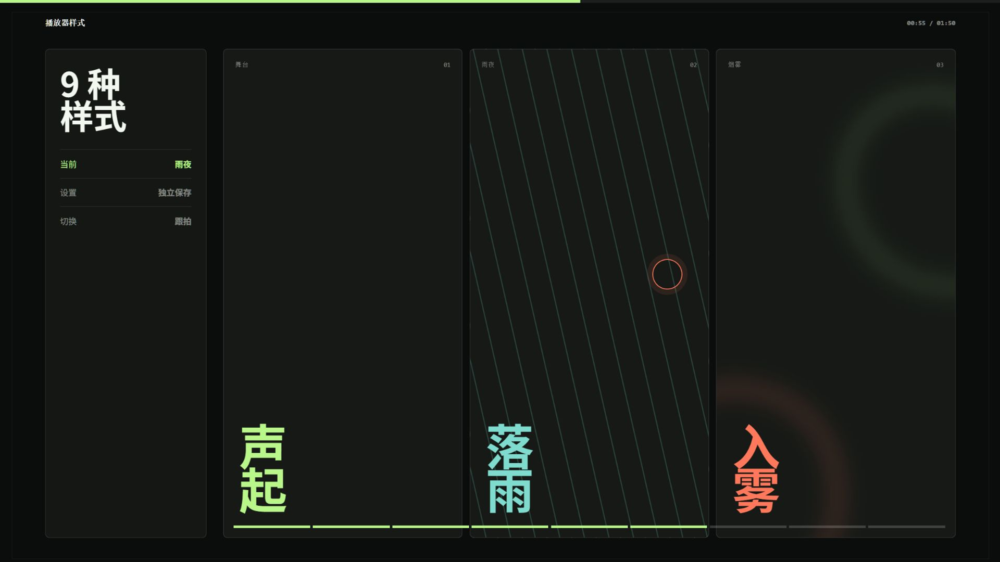
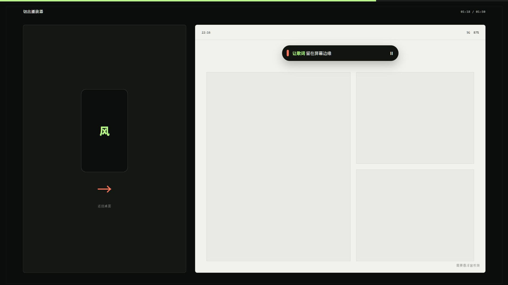

# Zephyrus Player 横版实测快剪审核方案

> 本文件未通过审核。当前方案为 [Zephyrus横版音乐节舞美工具推荐审核方案.md](./Zephyrus横版音乐节舞美工具推荐审核方案.md)。

当前阶段：视觉方向与口播审核

本文件用于确认视频的口吻、视觉和情绪安排。确认前不制作完整视频，也不索要口播音频。

## 已确认内容

| 项目 | 执行方案 | 依据 |
| --- | --- | --- |
| 视频用途 | 工具推荐，不按品牌广告片处理 | 重点是演示实际功能，同时说明限制和适合人群 |
| 发布平台 | 抖音、B 站 | 两个平台共用一支 16:9 横版母版，前三秒直接展示功能差异 |
| 时长 | 约 110 秒 | 保留完整解释，但不平均分配时间 |
| 画幅 | 1920×1080，30 fps | 用户已指定横版视频 |
| 视觉方向 | 实测快剪 | 真实操作、局部放大、点击反馈和前后对比为主要画面 |
| UI 素材 | 自行渲染少文字、无图片的合成 UI | 不使用歌曲封面、外部图片、真实歌名或完整歌词 |
| 口播 | 中文，自然推荐口吻 | 不虚构使用经历，不使用发布会式旁白 |
| 音乐 | 约 110 BPM 的轻电子音乐 | 中段可以连续加速，状态栏歌词出现前可以短暂抽掉节奏 |
| 信息边界 | 保留账号、网络、接口和悬浮窗权限等限制 | 让推荐判断建立在项目实际行为上 |

## 情绪安排

视频不会从头到尾保持同一种速度。

| 时间 | 情绪 | 声音与剪辑 |
| --- | --- | --- |
| 00:00-00:04 | 立刻产生差异 | 无片头，左右对比普通 LRC 和逐字歌词；第一下鼓点落在逐字高亮上 |
| 00:04-00:16 | 快速交代产品 | BGM 进入基础节奏，界面操作和口播一一对应 |
| 00:16-00:38 | 第一次抬升 | 逐字进度、背景声部、对唱、翻译和罗马音依次出现，切点逐渐变密 |
| 00:38-00:64 | 连续演示 | 多来源搜索和本地曲库交替出现，维持速度，不堆大字 |
| 00:64-00:82 | 主高潮 | 九种样式跟随鼓点切换，舞台、雨夜、烟雾各停留一个完整动作 |
| 00:82-00:86 | 突然安静 | 切出播放器时抽掉鼓组，只保留一次系统操作声 |
| 00:86-00:98 | 第二次惊喜 | 状态栏歌词出现，BGM 用较轻的低频重新进入 |
| 00:98-01:50 | 平稳收束 | 说明适合人群、使用限制和安装条件，结尾停留 1.5 秒 |

整支视频的主要起伏是：对比钩子、逐字歌词抬升、样式高潮、短暂安静、状态栏歌词反转、克制收尾。

## 110 秒口播稿

同一句歌词，左边只能整句滚动，右边已经跟到每个字。用 Android 听歌，又喜欢盯着歌词看的，可以先记住这个名字：Zephyrus Player。

它是一款开源播放器，最显眼的功能就是逐字歌词。播放歌曲后，它会按 TTML、YRC、QRC、LRC 的顺序查找歌词。匹配到逐字数据，每个字就会跟着进度变化；只有普通 LRC 时，也能按整句正常滚动。

歌词不只有主唱一行。背景声部、对唱、翻译和罗马音都能同时出现。看合唱、和声或者外语歌时，能看到的信息会多不少。

搜索歌曲时，它会把多个平台的结果放进同一个列表，还能按来源筛选。能否播放要看账号、接口和网络，但找不同版本时，不用在几个入口之间来回切换。

本地曲库也照顾到了。MP3、FLAC、M4A、OGG、Opus 可以扫描，LRC、YRC、TTML 和 TXT 歌词也能一起识别。

再看样式，这部分可以多停几秒。播放器一共有九种样式：默认、舞台、诡谲、狂热、陈旧、杂志、雨夜、星盘和烟雾。排版和动效都会变化，背景、歌词颜色、字体和高潮效果还能按样式分别保存。

还有一个很实用的小功能。允许悬浮窗权限后，切回桌面或者打开别的应用，主歌词仍然会留在状态栏。位置、字体和颜色都能调整。

如果你经常查看逐字歌词、有自己的本地曲库，或者喜欢调整播放器外观，这款比较值得尝试。只需要基础播放的话，它里面不少设置可能用不到。

Zephyrus Player 支持 Android 8.0 及以上。APK、源码和下载地址放在视频简介里。

## 口播表演提示

| 段落 | 语气 |
| --- | --- |
| 前四秒 | 直接、稍快，“右边已经跟到每个字”明显加重 |
| 产品和歌词 | 正常说明，在 TTML、YRC、QRC、LRC 之后留半拍 |
| 搜索和本地曲库 | 语速加快，但格式名必须清楚 |
| 九种样式 | 明显提高兴奋度，样式名按节奏分组，不要一口气念完 |
| 切出应用 | “还有一个很实用的小功能”前停半秒，音量略收 |
| 适合人群 | 回到平静说明，不做强行推荐 |
| 安装信息 | 简短、清楚，最后一句不拖长 |

## 三张关键画面

### 开场对比

画面只展示同一时间点的两种歌词状态。成片中先出现左侧整句，再在鼓点上切出右侧逐字高亮，整个过程控制在四秒内。

### 样式高潮

审核图展示舞台、雨夜和烟雾三个重点样式。成片会补齐九种样式，每次切换与鼓点同步；三个重点样式各完成一个动作，其余样式快速经过。

### 状态栏歌词

切出应用时音乐短暂停顿。右侧浅色界面用于制造明暗变化，状态栏歌词是这一段唯一的视觉重点，并保留“需要悬浮窗权限”提示。

## UI 制作口径

- 手机界面、搜索结果、本地文件、歌词和状态栏全部使用 HTML/CSS 自行渲染。
- UI 只保留当前操作需要的信息，不使用封面图片、专辑图片或人物素材。
- 所有歌名、歌手和歌词均为合成内容，不写入受版权保护的完整歌词。
- 普通 LRC 按整句显示；逐字效果使用合成 TTML/YRC/QRC 数据表现。
- 状态栏只展示主歌词，不把背景声部或对唱带到应用外。
- 多平台结果必须保留账号、接口和网络影响播放可用性的提示。

## 双平台处理

抖音和 B 站使用同一支 1920×1080 母版。字幕、点击标记和主要 UI 放在中央安全区域，保证手机横屏观看时仍然清楚。

抖音的标题建议使用“Android 逐字歌词播放器，歌词显示能有多细”；B 站标题建议使用“Zephyrus Player 体验：逐字歌词、九种样式和状态栏歌词”。标题只用于发布，不放进正片开场。

## 审核通过后的流程

1. 根据本方案完成镜头卡映射和最终分镜，提交一次制作前审核。
2. 分镜确认后，主动向用户索要按本稿录制的无音乐口播音频，优先接收 WAV，也可使用高码率 MP3。
3. 按实际口播波形调整切点和总时长，再确定 BGM、音效和字幕时间轴。
4. 自行渲染所需 UI，制作 1920×1080 完整视频。
5. 交付带 BGM 版和无 BGM 版；两版均保留必要音效。

本轮需要确认：口播内容、三张关键画面和情绪安排是否可以进入镜头映射阶段。
