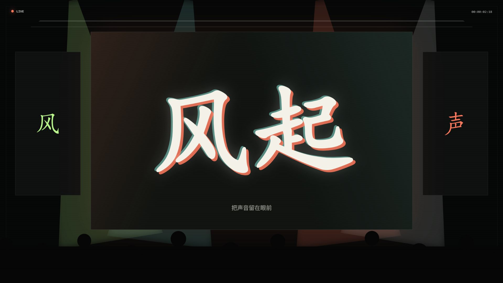
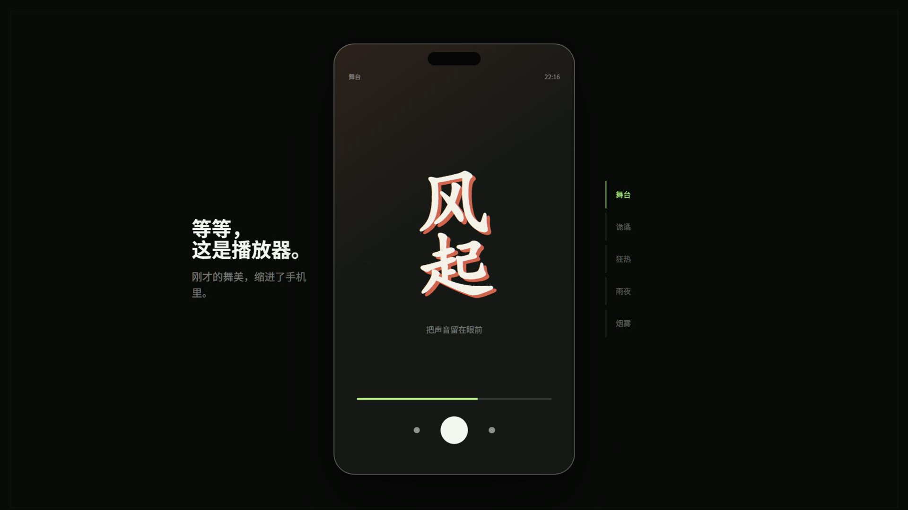

# Zephyrus Player 横版音乐节舞美工具推荐审核方案

当前阶段：视觉方向已确定，等待镜头卡映射确认

本方案把视频的切入点改为音乐节舞美。开场先展示书法字体、大字歌词、灯光和人群，随后把整个舞台缩进手机屏幕，再揭示 Zephyrus Player。软件的特异点不再被包装成使用痛点，而是作为观众想继续查看的视觉兴趣点。

## 已确认内容

| 项目 | 执行方案 | 依据 |
| --- | --- | --- |
| 视频用途 | 工具推荐，允许适量整活 | 需要让观众愿意继续看，同时保留功能和限制说明 |
| 发布平台 | 抖音、B 站 | 开场需要在前三秒出现清楚的视觉刺激和问题 |
| 时长 | 约 110 秒 | 用户希望加长，不压缩成功能速览 |
| 画幅 | 1920×1080，30 fps | 用户已指定横版 |
| 视觉切入 | 音乐节舞美 | 书法字、大字歌词、灯光和烟雾与播放器的九种样式有直接联系 |
| 软件 UI | 自行渲染少文字、无图片的合成 UI | 不使用歌曲封面、专辑图片或真实用户数据 |
| 音乐节片段 | 1.8 至 2.3 秒的授权实拍片段，或程序化舞台动画 | 原声静音，不出现艺人肖像、活动品牌和真实歌曲文字 |
| 口播 | 中文工具推荐口吻 | 不虚构使用经历，不使用发布会式旁白 |
| 配音 | MiMo 音色复刻 TTS，110.56 秒 | 使用用户提供的参考音频，API 密钥未写入项目文件 |
| 信息边界 | 说明账号、接口、网络和悬浮窗权限限制 | 推荐判断不能省略真实使用条件 |

## 核心转折

开场看起来像一期音乐节舞美观察。观众刚看到完整舞台，画面突然定格并迅速拉远，舞台变成手机播放器中的“舞台”样式。口播同时说：“等一下，我今天不是来推荐音乐节的。”

这个转折同时完成三件事：

- 音乐节画面负责吸引注意力。
- 舞台缩进手机，直接说明产品和开场的关系。
- 一句打断式口播制造轻微喜剧感，不需要额外解释梗。

## 110 秒情绪安排

| 时间 | 内容 | 情绪与声音 |
| --- | --- | --- |
| 00:00-00:04 | 询问音乐节舞美是否好看 | 从低频环境声开始，书法字与大字歌词快速出现 |
| 00:04-00:08 | 突然插入音乐节视频 | 人群声和一次低频冲击进入，画面达到第一个高点 |
| 00:08-00:13 | 定格并拉远，舞台缩进手机 | 唱片刹停声；口播“等一下”，短暂停顿后揭示播放器 |
| 00:13-00:36 | 展示九种播放器样式 | 节奏重新进入，舞台、狂热、雨夜和烟雾随拍切换 |
| 00:36-00:58 | 展示逐字歌词和多声部 | 节奏稍缓，镜头贴近文字进度，建立功能可信度 |
| 00:58-01:12 | 多平台搜索 | 操作速度加快；筛选和结果进入跟随鼓点 |
| 01:12-01:17 | 插入资源不可用提示 | 第二次短暂停顿；口播说明账号、接口和网络限制 |
| 01:17-01:29 | 本地曲库 | 恢复稳定节奏，列表扫描和格式识别连续出现 |
| 01:29-01:41 | 状态栏歌词 | 切出应用后歌词保留，形成第二个产品惊喜点 |
| 01:41-01:50 | 适合人群与安装信息 | 音乐收束，说明适用情况、Android 版本和下载位置 |

情绪走向：好奇、舞台高点、喜剧式打断、样式高潮、功能沉浸、限制小梗、状态栏惊喜、克制结束。

## 口播稿

你，去过音乐节吗？

在音乐节上，引人注目的不只有现场音乐和狂热的气氛，还有屏幕上的舞美。书法字体、大字歌词，再配上灯光和烟雾，现场感一下就来了。

等一下，我今天不是来宣传音乐节的。刚才这套画面，可以缩进一台 Android 手机上。

这是 Zephyrus Player，一款开源音乐播放器。它有九种播放器样式：默认、舞台、诡谲、狂热、陈旧、杂志、雨夜、星盘和烟雾。每种样式不只是换一张背景，歌词排版、字体和动效也会跟着变化。背景、歌词颜色、字重和高潮效果还能分别保存。

样式做得热闹，歌词数据也没有落下。播放歌曲后，它会按 TTML、YRC、QRC、LRC 的顺序查找歌词。匹配到逐字数据，每个字会跟着进度变化；只有普通 LRC 时，也能按整句滚动。

背景声部、对唱、翻译和罗马音可以同时显示。合唱、和声或者外语歌的信息会更完整。

搜索歌曲时，多个平台的结果会放进同一个列表，还能按来源筛选。先别急着高兴，能否播放仍然要看账号、接口和网络状态。设置里还留了一个解锁密钥入口，填入从项目群获得的有效口令后，可以尝试解锁 VIP 歌曲。实际能否播放，还是要看服务状态和版权限制。

它也支持本地曲库。MP3、FLAC、M4A、OGG、Opus 都能扫描，内嵌的歌词和封面也能一起识别。

允许悬浮窗权限后，切回桌面或者打开别的应用，主歌词仍然会留在状态栏。位置、字体和颜色都能调整。

如果你喜欢音乐节舞美的效果，或者觉得常见音乐平台的广告和页面太重，可以试试它。它支持 Android 8.0 及以上。安装包的下载地址放在视频简介里。

## 口播表演提示

| 段落 | 语气与停顿 |
| --- | --- |
| 音乐节提问 | 像正常聊天，念到“书法字体、大字歌词”时随画面加快 |
| “等一下” | 单独成句，先让音乐和画面同时停住，再开口 |
| 九种样式 | 兴奋度最高，样式名按两到三组念，不要一口气报完 |
| 歌词功能 | 语速恢复正常，让观众看清逐字进度和声部变化 |
| “先别急着高兴” | 轻微调侃，不使用夸张搞笑配音 |
| 状态栏歌词 | 在切出应用后停半秒，再说结果 |
| 结尾 | 平静说明适合人群和限制，不喊口号 |

## 关键样帧

### 音乐节误导镜头

样帧使用程序化舞台确认构图。完整制作优先替换为无品牌、无艺人肖像、可用于成片的授权实拍片段；如果没有合适素材，就把程序化舞台制作成动态镜头。原片音乐全部静音，只保留自制人群声和冲击音效。

### 缩进播放器

音乐节画面定格后快速拉远，舞台大屏与手机播放器的书法歌词完成位置匹配。手机 UI 不使用封面图片，只显示样式名称、合成歌词、进度和播放控制。

### 中段样式高潮

开场已经展示过“舞台”，中段不会重复同一个动作。这里改为横向切换九种样式，舞台只快速经过，狂热、雨夜和烟雾承担主要节奏点。

### 状态栏歌词

第二个产品惊喜点仍然保留。切出应用后先停半秒，再让状态栏歌词出现，并同时标注需要悬浮窗权限。

## 整活的边界

- 音乐节误导是全片唯一的大转折，持续不超过八秒。
- 多平台搜索后的资源不可用提示只停留约一秒，用来说明真实限制。
- 不使用网络热梗、鬼畜音效、夸张表情包或与产品无关的随机插片。
- 不把第三方演出视频伪装成 Zephyrus Player 的实际画面。
- 音乐节素材必须有明确授权或使用程序化替代方案。

## UI 与素材口径

- 软件 UI 全部自行渲染，保持少文字、无图片。
- 歌名、歌手和歌词全部使用合成内容，不展示真实歌曲封面和完整歌词。
- 音乐节片段属于叙事素材，不作为软件 UI 的一部分。
- 多平台结果保留账号、接口和网络影响播放可用性的提示。
- 状态栏只显示主歌词，背景声部和对唱保留在应用内播放器。
- 字幕、手机 UI 和主要操作放在横版中央安全区域，兼顾抖音与 B 站播放界面。

## 发布标题建议

- 抖音：我以为这是音乐节舞美，结果是个播放器
- B 站：把音乐节舞美装进播放器？Zephyrus Player 体验

## 审核通过后的流程

1. 审核镜头卡映射，确定每一段采用的运动语言。
2. 映射确认后，读取所选镜头卡的完整参数和参考实现，完成帧级分镜。
3. 按已经生成的 110.56 秒 TTS 波形调整切点，再选择 BGM、制作人群声和操作音效。
4. 采集授权音乐节素材，或制作程序化舞台动画；软件 UI 由项目内 HTML/CSS 自行渲染。
5. 制作 1920×1080 完整视频，交付带 BGM 版和无 BGM 版。

镜头卡映射见《Zephyrus横版镜头卡映射审核.md》。本轮确认后进入帧级分镜和完整视频制作。
